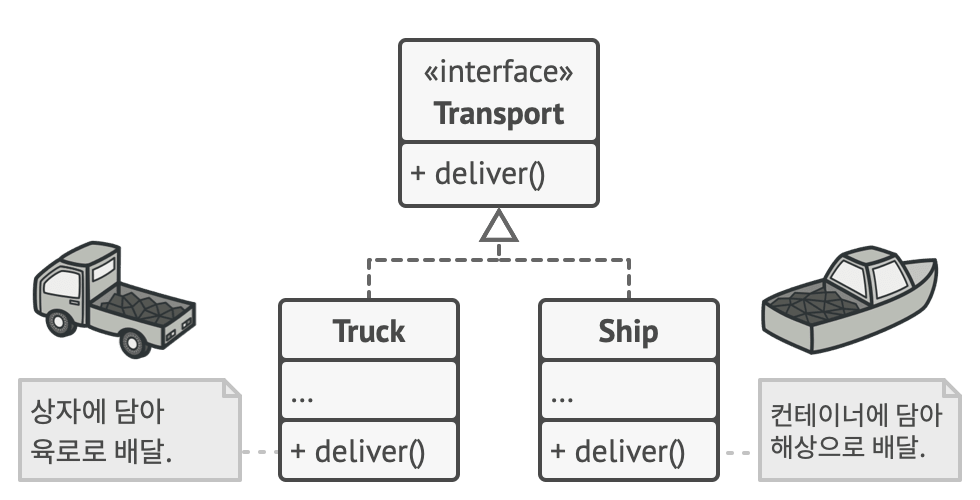

# 최대공약수(GCD)와 최소공배수(LCM)

<figure><figcaption></figcaption></figure>

옛날 옛적, 숫자 왕국에는 두 개의 마을이 있었습니다.

하나는 “최대공약수(GCD) 마을” 다른 하나는 “최소공배수(LCM) 마을”이었죠.

두 마을은 오랫동안 서로의 방식을 주장하며 싸웠습니다.

GCD 마을은 공통된 부분을 찾아 가장 큰 것을 나누는 것이 정의롭다!라고 주장했고,

LCM 마을은 공통된 특징을 이용해 가장 작은 조화를 이루는 것이 중요하다!라고 외쳤습니다.

왕국의 왕은 고민 끝에, 두 마을의 차이를 정확히 알고 평화를 이루기 위해 수학 법정을 열었습니다.

그리고 이렇게 선언했어요.

“이제부터 두 마을의 역할을 정확히 정의하고, 프로그래머들이 너희의 원리를 코드로 구현할 것이다!”

\


<figure><figcaption></figcaption></figure>

## ⚖️ 최대공약수(GCD): 공통된 약수를 찾아라!

### 📜 GCD 마을의 원칙

최대공약수는 두 수가 공통으로 나누어지는 가장 큰 수입니다.

예를 들어 24와 36의 최대공약수를 찾는다고 해봅시다.

각 숫자의 약수를 구해보면,

24의 약수: 1, 2, 3, 4, 6, 8, 12, 24

36의 약수: 1, 2, 3, 4, 6, 9, 12, 18, 36

공통된 약수: 1, 2, 3, 4, 6, 12

가장 큰 공약수는 12!&#x20;

#### 🧑‍💻 GCD를 JavaScript & TypeScript로 구현

### 1️⃣ 반복문을 사용한 방식

```typescript
function gcdLoop(a: number, b: number): number {
  let gcd = 1;
  for (let i = 1; i <= Math.min(a, b); i++) {
    if (a % i === 0 && b % i === 0) {
      gcd = i;
    }
  }
  return gcd;
}

console.log(gcdLoop(24, 36)); // 12

```

### 2️⃣ 유클리드 알고리즘 (최적화된 방법)

유클리드 알고리즘은 “큰 수에서 작은 수를 계속 빼거나 나눈 나머지를 사용하여 GCD를 찾는 방식”입니다.

```typescript
function gcd(a: number, b: number): number {
  return b === 0 ? a : gcd(b, a % b);
}

console.log(gcd(24, 36)); // 12

```


재귀를 사용하여 간결하게 구현 가능하네요!

그렇다면, 유클리드 알고리즘을 반복문으로도 구현할 수 있을까요?

그럼요. 유클리드 알고리즘은 재귀(Recursion)뿐만 아니라 반복문(Iteration) 을 이용해서도 구현할 수 있습니다.

반복문을 활용하면 재귀 호출로 인한 스택 오버플로우 문제를 방지할 수 있어서 대규모 연산에서도 안전한 방식이 될 수 있답니다.

📌 반복문을 이용한 유클리드 알고리즘 (GCD)

function gcdIterative(a: number, b: number): number {

&#x20; while (b !== 0) {

&#x20;   let temp = b;

&#x20;   b = a % b;

&#x20;   a = temp;

&#x20; }

&#x20; return a;

}

\


console.log(gcdIterative(24, 36)); // 12

console.log(gcdIterative(48, 18)); // 6

while 문을 이용해 b가 0이 될 때까지 반복하면서 나머지를 갱신하는 방식입니다. 이 방식은 재귀 호출 없이도 유클리드 알고리즘을 구현할 수 있어서 더 안전하고 효율적일 수 있습니다.

\


## ⚖️ 최소공배수(LCM): 공통 배수를 찾아라!

### 📜 LCM 마을의 원칙

최소공배수는 두 수가 공통으로 나오는 가장 작은 배수입니다.

예를 들어 6과 8의 최소공배수를 찾아봅시다.

각 숫자의 배수를 구해보면:

* 6의 배수: 6, 12, 18, 24, 30, 36, 42, …
* 8의 배수: 8, 16, 24, 32, 40, 48, …
* 공통된 배수 중 가장 작은 것은 24!&#x20;

#### 🧑‍💻 LCM을 JavaScript & TypeScript로 구현

### 1️⃣ 기본적인 방식 (배수 나열)

```typescript
function lcmLoop(a: number, b: number): number {
  let max = Math.max(a, b);
  while (true) {
    if (max % a === 0 && max % b === 0) {
      return max;
    }
    max++;
  }
}

console.log(lcmLoop(6, 8)); // 24

```

이 방식은 매우 비효율적이므로 개선이 필요했어요! 😅\


### 2️⃣ GCD를 활용한 최적화된 LCM 계산

수학 공식

$$
f(x) = x * e^{2 pi i \xi x}
$$


function lcm(a: number, b: number): number {

&#x20; return (a \* b) / gcd(a, b);

}

\


console.log(lcm(6, 8)); // 24

유클리드 알고리즘을 활용하여 LCM을 최적화! 🔥

\


🏛️ 왕국의 화해: GCD와 LCM의 조화

GCD 마을과 LCM 마을은 결국 깨달았답니다.

“우리는 서로 다른 방식으로 숫자를 다루지만, 결국 같은 목표를 향해 나아가고 있다!”

두 마을은 하나의 수학적 원리로 연결되었다고 하는 그런 스토리!

GCD는 나누는 데 강하고, LCM은 곱하는 데 강할 뿐이라고요.

이제 왕국의 프로그래머들은 최적의 알고리즘을 구현할 수 있게 되었답니다! 🏆

\


💡 최종 정리

\


📌 정확하고 빠르게 구하기 위해 GCD를 유클리드 알고리즘으로, LCM은 GCD를 이용해 구하는 것이 효율적입니다.

\


\


\


GCD와 LCM을 활용하는 실제 프로그래밍 사례에는 어떤 것들이 있을까요?

1️⃣ 일정 시간 간격을 맞추는 문제 (타이머 & 주기적 실행)

게임, 애니메이션, 시스템 프로그래밍에서 동기화된 주기 실행이 필요할 때 활용되곤 합니다.&#x20;

예를 들어, 3초마다 이벤트 A가 발생하고, 5초마다 이벤트 B가 발생할 때, 두 이벤트가 동시에 실행되는 최소 시간은? LCM(3, 5) = 15 → 15초마다 동시 실행되죠. 이 원리는 멀티쓰레딩 타이머, UI 프레임 동기화 등에서도 사용되고 있습니다.

2️⃣ 그래픽 프로그래밍 (픽셀 크기 맞추기)

디지털 화면에서 이미지를 변형할 때 공통된 배율(dpr)을 찾을 필요가 있습니다.

예를 들어, 1920×1080 해상도의 이미지를 1280×720으로 변환한다고 할 때, 최대공약수(GCD)를 이용하면 비율을 유지하며 축소 가능합니다. GCD를 이용해 가장 간단한 가로:세로 비율을 찾을 수 있습니다.

function simplifyResolution(width: number, height: number) {

&#x20; let gcdValue = gcdIterative(width, height);

&#x20; return \[width / gcdValue, height / gcdValue];

}

\


console.log(simplifyResolution(1920, 1080)); // \[16, 9]

console.log(simplifyResolution(1280, 720)); // \[16, 9]

그래픽 프로그래밍 - 비트맵과 해상도 처리

이미지 리사이징에서 GCD를 사용하면 픽셀 비율을 유지한 채 크기 조절이 가능해.

또한 LCM을 활용하면 여러 화면 크기에서 일관된 크기를 유지하는 레이아웃 시스템을 만들 수 있어!

function scaleImage(width: number, height: number, factor: number) {

&#x20; return \[width \* factor, height \* factor];

}

\


console.log(scaleImage(16, 9, 2)); // \[32, 18] - 2배 확대

📺 LCM을 이용하면 해상도별로 적절한 크기로 배율을 조정할 수 있음!

3️⃣ 암호학 및 보안 (RSA 암호 알고리즘)

공개 키 암호화 방식인 RSA 알고리즘에서는 GCD를 이용해 서로소(공통 약수가 1뿐인 수)를 찾는 과정이 중요합니다.&#x20;

서로소 관계가 있는 숫자(e.g., 𝑝, 𝑞)를 기반으로 키를 생성하기 때문에, GCD가 1인지 검사하는 것이 필수죠.

function isCoprime(a: number, b: number): boolean {

&#x20; return gcdIterative(a, b) === 1;

}

\


console.log(isCoprime(35, 64)); // true (서로소)

console.log(isCoprime(20, 25)); // false (공약수 5가 존재)

\


RSA 알고리즘에서는 큰 소수 두 개(𝑝, 𝑞)를 선택하고, 곱셈한 결과를 이용해 키를 생성해.

이 과정에서 GCD(e, φ(n)) = 1을 만족하는 e 값을 찾아야 하는데, GCD 계산이 필수적으로 사용됩니다.

function findValidE(phi: number): number {

&#x20; for (let e = 2; e < phi; e++) {

&#x20;   if (gcdIterative(e, phi) === 1) {

&#x20;     return e; // 서로소인 e 찾기

&#x20;   }

&#x20; }

&#x20; return -1; // 찾지 못한 경우

}

\


console.log(findValidE(40)); // 3 (서로소인 값 중 가장 작은 수)

💡 GCD를 활용해 서로소를 찾고, 안전한 공개키를 생성하는 것이 RSA 암호화의 핵심!

\


4️⃣ 데이터 전송 및 네트워크 동기화

GCD를 활용한 패킷 전송 최적화: 서로 다른 속도로 데이터를 전송하는 경우, GCD를 이용해 최적의 전송 간격을 찾을 수 있습니다.

LCM을 활용한 주기적 네트워크 요청: 두 개 이상의 서버가 일정한 주기로 요청을 보낼 때, LCM을 이용해 최소한의 요청 간격을 설정할 수 있습니다.

\


\


\


\


